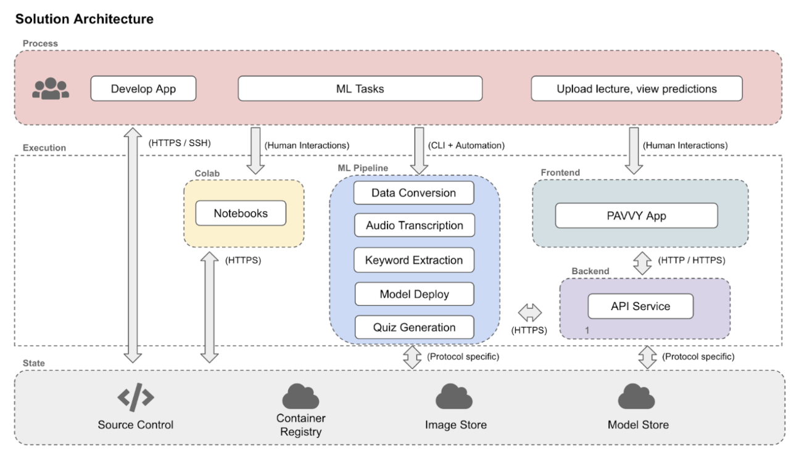
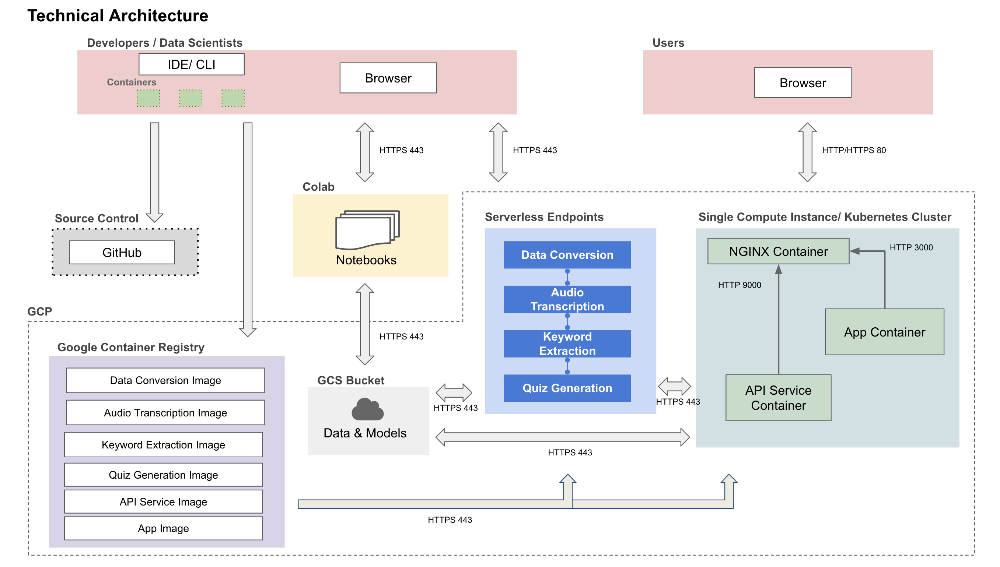
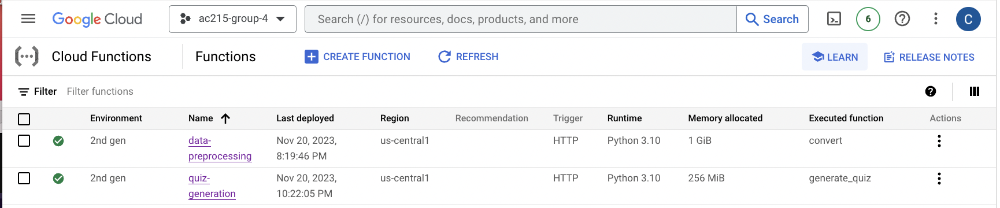
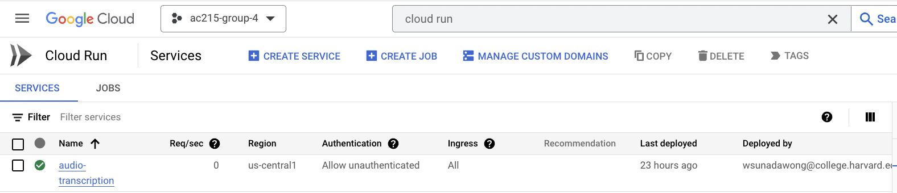
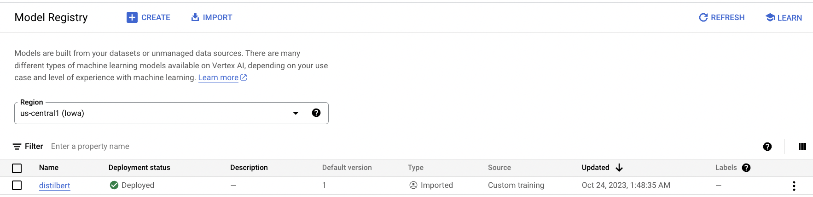

AC215 - Milestone5

Project Organization
------------
    .
    ├── LICENSE
    ├── .dvc 
    ├── notebooks            <- Jupyter notebooks for EDA and model testing
    │   ├── intial_model_construction.ipynb
    │   └── tf_intial_model_construction_with_multigpu.ipynb
    ├── README.md
    ├── reports              <- Reports, midterm presentation, application design document
    │   ├── application_design.pdf
    │   ├── milestone2.pdf
    │   ├── milestone3.pdf
    │   ├── milestone4.md
    │   └── milestone4_presentation.pdf
    ├── images               <- Folder containing images used in reports
    ├── cli.py               <- Files in the root of repo for data versioning
    ├── docker-shell.sh
    ├── Dockerfile
    ├── Pipfile
    ├── Pipfile.lock
    ├── requirements.txt
    ├── keyword_dataset.dvc
    └── src                  <- Source code and Dockerfiles for training and deployment
        ├── individual-containers   <- Initial iteration of containers to be run independently of the pipeline, from earlier milestones
        ├── pipeline-workflow
        │   ├── model-deployment    <- Script to deploy and get predictions from the keyword extraction model
        │   │   └── ...
        │   ├── audio-transcription <- Use Whisper JAX for transcription
        │   │   └── ...
        │   ├── quiz-generation     <- Generate quizzes from transcribed text
        │   │   └── ...
        │   ├── data-conversion     <- Convert video to audio file
        │   │   └── ...
        │   └── model_training      <- Scripts for training keyword extraction model
        │       └── ...  
        ├── api-service     <- Code for backend
        │   ├── api                 <- Scripts that call cloud functions, cloud run, and Distilbert endpoint
        │   │   ├── model.py
        │   │   ├── service.py
        │   │   └── tracker.py
        │   ├── docker-shell.sh
        │   ├── docker-entrypoint.sh
        │   ├── Dockerfile
        │   ├── Pipfile
        │   └── Pipfile.lock
        ├── frontend-react <- Code for frontend
        │   └── ...
        └── deployment     <- Code for deployment to GCP with Ansible
            └── ...


--------
# AC215 - Milestone5 - Learning Tools for Transcribed Lecture Audio

**Team Members**
Cyrus Asgari, Ben Ray, Caleb Saul, Warren Sunada Wong, Chase Van Amburg

**Group Name**
Pavlos' Perceptron Pals

**Project**
In this project we aim to develop an application that can process lecture videos to generate transcripts with key-word highlighting and offer auto-generated quizzes with both questions and answers.

**Recap of work to date (see `reports/` for more details)**
We built the four main containers - video to audio preprocessing, audio transcription, keyword highlighting, quiz generation - that are deployed in our pipeline. These can be run atomically from the `individual-containers/` directory. In addition, we have a container that takes care of data versioning (found in the root of the repository) and a container that runs training for our keyword extraction model (found in `pipeline-workflow/model-training`). 

We have utilized several advanced tools to optimize our data preprocessing and training workflows, including usage of TensorFlow Data, Dask for efficient transformations of lecture videos, support for serverless training with Vertex AI on multiple GPUs, and performance tracking with Weights & Biases. Our training efforts were primarily focused on training our keyword extraction model, using different derivations of the BERT model. All experiments were run on a single A100 GPU on Vertex AI, although we have also fully implemented and tested support for training on multiple GPUs, using TensorFlow's support for distributed training (i.e. `tf.distribute.MirroredStrategy()`). We chose to deploy the `distilbert-base-uncased` model, which performed well in terms of inference time and achieved 99% of the performance of the undistilled `bert-base-uncased` model.

Upon completing training, our four main containers were formulated into a Vertex AI (Kubeflow) pipeline, allowing for effective orchestration of our app's components and usage of cloud functions in Milestone 5.

### Milestone 5 ###

In this milestone, we have focused on the development and deployment of a backend API service and the client-side of the application. Before implementing this, we created a detailed design document outlining the application’s Solution and Technical architectures, which can be found in `reports/application_design.pdf`.






Our backend leverages many of the tools made accessible by AC215. Our [video to audio preprocessing container](https://us-central1-ac215-group-4.cloudfunctions.net/data-preprocessing) and [quiz generation container](https://us-central1-ac215-group-4.cloudfunctions.net/quiz-generation) are deployed as cloud functions on GCP, since they are relatively lightweight. A screenshot of these deployed cloud functions, which run severlessly, is included below:




By comparison, our audio transcription container, which calls the Whisper-Jax model, takes far longer to run, and so benefits further optimization within its own Docker container. Thus, we chose to deploy the [audio transcription container](https://audio-transcription-hcsan6rz2q-uc.a.run.app/) in Cloud Run. A screenshot of the deployed cloud run, which also runs severlessly, is included below:




Finally, as completed in class, we deployed our trained DistilBERT model from the keyword extraction container to its own endpoint on GCP. This allows for efficient updates of this model in future, without needing to redploy an entire container image on Cloud Run or a new cloud function. A screenshot of the deployed model endpoint is included below:




Our frontend interface is built in React and is contained within the `src/frontend-react` directory. At this stage, the frontend represents a minimum viable product for a user. This means that a user can upload either a video or a text file and receive both the keywords and the generated quiz, but they have limited ability to re-format the outputs (e.g. as a highlighted transcript, instead of a list of keywords). Such features that make the frontend more user-friendly will follow in Milestone 6.

Finally, we used Ansible to create, provision, and deploy our frontend and backend to GCP in an automated fashion.

In the remainder of this update, we will explain the code structure of the [deliverables](https://harvard-iacs.github.io/2023-AC215/milestone5/) for Milestone 5. Given the size of the codebase, please note that we reserve this space for describing the deliverables for Milestone 5 only, and usage of other parts of the codebase is desribed in earlier reports (see `reports/`).

#### Code Structure

**Backend API Service Implementation**

We built a backend api service using fast API to expose model functionality to the frontend. Fast API gives us an interactive API documentation and exploration tool for free. An image of the documation tool is included below:


/predict is called when users upload a lecture video to the frontend and wish to extract keywords and generate a quiz from it. /predicttext is used when users upload a lecture transcript to the frontend and wish to extract keywords and generate a quiz from it. These options are clear to see in the frontend below.

We can also easily test our APIs using this tool. Screenshots from successful tests of both /predict and /predicttext are included below:


It is clear to see from this testing that the server response is successful, with the response body returning keywords and a generated quiz as expected.


The `api-service` container has all the files to run and expose the backend APIs.

To run the container locally:
- Open a terminal and navigate to `/src/api-service`
- Run `sh docker-shell.sh`
- Once inside the docker container run `uvicorn_server`
- To view and test APIs go to `http://localhost:9000/docs`

**Frontend Implementation**

We have built a React app to extract keywords and generate quizzes from lecture videos or lecture transcripts. Using the app, a user easily uploads their lecture video file. The app will send the video or text file through to the backend API to get the outputs.

Here are some screenshots of our app:

INSERT SS OF FRONTEND HERE

The `frontend-react` container contains all the files to develop and build our React app.

To run the container locally:
- Open a terminal and navigate to `/src/frontend-react`
- Run `sh docker-shell.sh`
- If running the container for the first time, run `npm install`
- Once inside the docker container run `yarn start`
- Go to `http://localhost:3000` to access the app locally

**Ansible Usage For Automated Deployment**

We use Ansible to create, provision, and deploy our frontend and backend to GCP in an automated fashion. Ansible allows us to manage infrastructure as code, helping us keep track of our app infrastructure as code in GitHub. It helps use setup deployments in an automated way.

Here is our deployed app on a single VM in GCP:


The deployment container helps manage building and deploying all our app containers through Ansible, with all Docker images going to the Google Container Registry (GCR). 

To run the container locally:
- Open a terminal and navigate to `/src/deployment`
- Run `sh docker-shell.sh`
- Build and push Docker Containers to GCR
```
ansible-playbook deploy-docker-images.yml -i inventory.yml
```

- Create Compute Instance (VM) Server in GCP
```
ansible-playbook deploy-create-instance.yml -i inventory.yml --extra-vars cluster_state=present
```

- Provision Compute Instance in GCP, install and setup all the required things for deployment.
```
ansible-playbook deploy-provision-instance.yml -i inventory.yml
```

- Setup Docker Containers in the  Compute Instance
```
ansible-playbook deploy-setup-containers.yml -i inventory.yml
```

- Setup Webserver on the Compute Instance
```
ansible-playbook deploy-setup-webserver.yml -i inventory.yml
```
Once the command runs go to `http://<External IP>/` to interact with the website.
