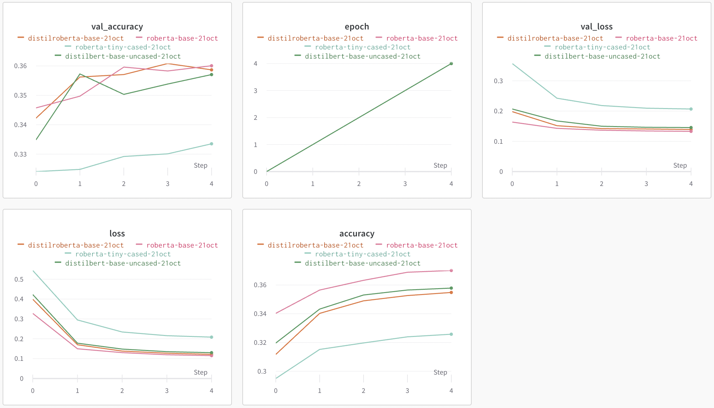
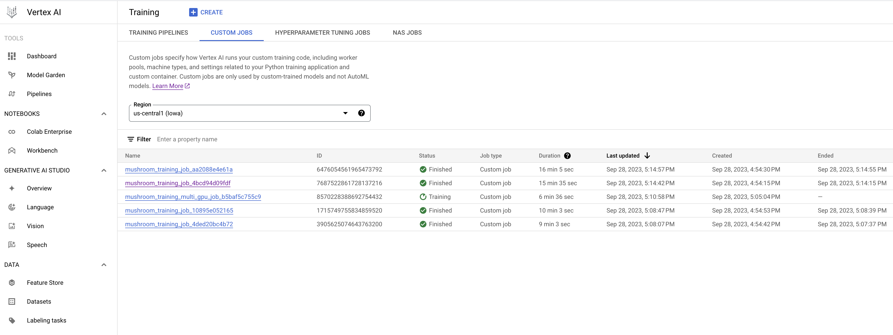

AC215-Template
==============================

AC215

Notes:

    The files are empty placeholders only
    Never commit large data files,trained models, personal API Keys/secrets to GitHub

Project Organization
------------

    .
    ├── data # DO NOT UPLOAD DATA
    │   ├── interim          <- Intermediate preprocessed data
    │   │   ├── test.csv
    │   │   ├── train.csv
    │   │   └── val.csv
    │   ├── processed        <- Final dataset files for modeling
    │   │   ├── file_00-0.tfrec
    │   │   ├── file_00-1.tfrec
    │   │   ├── file_00-2.tfrec
    │   │   └── file_00-3.tfrec
    │   └── raw              <- Original immutable input data
    │       └── training_data.zip
    ├── LICENSE
    ├── notebooks            <- Jupyter notebooks for EDA and model testing
    │   ├── eda.ipynb
    │   └── model_testing.ipynb
    ├── README.md
    ├── references           <- Reference materials such as papers
    ├── reports              <- Folder containing your milestone markdown submissions
    │   ├── milestone2.md
    │   └── milestone3.md
    ├── requirements.txt
    ├── src                  <- Source code and Dockerfiles for data processing and modeling
    │   ├── datapipeline     <- Scripts for dataset creation
    │   │   ├── build_records.py
    │   │   ├── dataloader.py
    │   │   ├── Dockerfile
    │   │   ├── process.py
    │   │   ├── Pipfile.lock
    │   │   └── Pipfile
    │   └── models           <- Model training, evaluation, and prediction code
    │       └── vgg16
    │           ├── Dockerfile
    │           ├── Pipfile
    │           ├── Pipfile.lock
    │           └── train_multi_gpu.py
    └── test_project.py

--------

# AC215 - Milestone3 - ButterFlyer

**Team Members**
Pavlov Protovief, Paolo Primopadre and Pablo El Padron

**Group Name**
Awesome Group

**Project**
In this project we aim to develop an application that can identify various species of butterflies in the wild using computer vision and offer educational content through a chatbot interface.

### Milestone3

We further streamlined our data pipeline process for this milestone by performing several transformations transformations, such as converting the data to TFRecords. This additional preprocessing was required as we discovered our model architecture was over fitting when only scaling the images. The use of TFRecords resulted in little performance gain, but this might result from our dataset consisting primarily of images and simple labels. 

Regarding the modeling process, Google denied our request for multiple GPU compute instances. However, we did design our training script so that we could pass in the arguments defining the number of GPUs to use. To get this to work within the Docker container, we used CMD, which allows us to use the default single GPU training code or overwrite it should more GPUs become available. 

**Experiment Tracking**

Below you can see the output from our Weights & Biases page. We used this tool to track several iterations of our model training. It was tracked using the `wandb` library we included inside of our `train.py` script. 

**Serverless Training**

(If Google increases your GPU quota)

Inside our training container, we used the Google Cloud SDK to launch training instances in the cloud. In the image below, you can see several runs of our model. 

To create a new serverless job we did the following commands: `The steps for running serverless training instances with your code`

#### Code Structure

**Data Folder**
Don't submit data, but we want to show one possible way of structuring data transformations.

**Data Processing Container**

- This container reads 100GB of data, transforming the images to TFRecords and stores them on a GCP bucket
- Input to this container is source and destination GCS location, parameters for resizing, secrets needed - via docker
- Output from this container stored on GCP bucket

(1) `src/datapipeline/dataloader.py`  - This script loads the original immutable data to our compute instance's local `raw` folder for processing.

(2) `src/datapipeline/build_records.py`  - Loads a local copy of the dataset, processes it according to our new transformations, converts it to TFRecords, and pushes it to a GCP bucket sink.

(3) `src/preprocessing/Dockerfile` - This dockerfile starts with  `python:3.8-slim-buster`. This <statement> attaches volume to the docker container and also uses secrets (not to be stored on GitHub) to connect to GCS.

To run Dockerfile - `Instructions here`

**VGG16 Training Container**

- This container contains all our training scripts and modeling components. It will use data from a GCP bucket, train, and then output model artifacts (saved model) to a GCP bucket.
- The input for this container is the source bucket for our training data and the output bucket for storing the trained model.
- Output is a saved TF Keras model.

(1) `src/models/vgg16/train_multi_gpu.py` - This script converts incoming data to TFRecords, applies standard image augmentation, and fits the model. It takes the following arguments:

> > --gpu [int] : the number of GPUs to use for training, default is 1
> > --input [string] : the source of the training data
> > --output [string] : the bucket which to store model artifacts

(3) `src/models/vgg16/Dockerfile` - This dockerfile starts with  `python:3.8-slim-buster`. This <statement> attaches volume to the docker container and also uses secrets (not to be stored on GitHub) to connect to GCS.

To run Dockerfile - `Instructions here`

**Notebooks** 
This folder contains code that is not part of container - for e.g: EDA, any 🔍 🕵️‍♀️ 🕵️‍♂️ crucial insights, reports or visualizations. 
