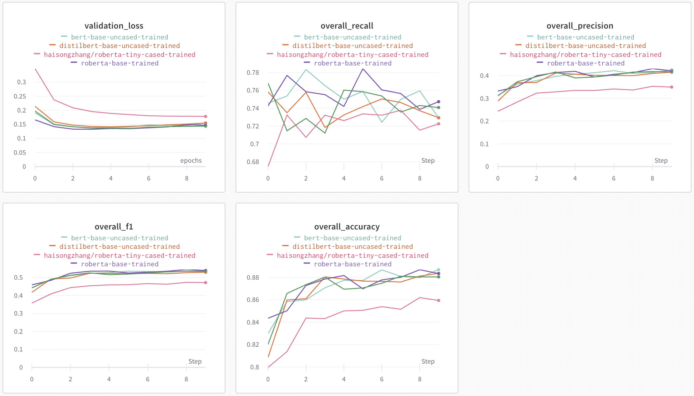

# PAVVY: Learning Tools for Lecture Content

*Pavlos' Perceptron Pals (Cyrus Asgari, Ben Ray, Caleb Saul, Warren Sunada Wong, Chase Van Amburg)*

This repository was produced as part of the final project for Harvard’s AC215 Fall 2023 course. The purpose of this `README` is to explain to a developer how to utilize this repository, including usage of the individual containers that comprise the PAVVY app, the model training workflow, and deployment to a Kubernetes Cluster using Ansible. For a more accessible overview of the project, please see our Medium post [here](TODO) and a video (including a live demo of PAVVY) [here](https://youtu.be/cfEjLLcUEgk?si=rVn4BaZa7n7fj4o8).

## Introduction

PAVVY is an application that can process lecture videos or transcripts to produce keyphrases and generate quizzes, which allow learners to better review and engage with lecture content.

The deployed PAVVY application comprises of four main containers - video to audio preprocessing, audio transcription, keyword highlighting, quiz generation. These four containers can be run atomically from the `src/pipeline-workflow/` directory. In addition, we have a container that takes care of data versioning (found in the root of the repository) and a container that runs training for our keyword extraction model (found in `src/pipeline-workflow/model-training`).

We utilized several MLOps tools to optimize our data preprocessing and training workflows, including usage of TensorFlow Data, Dask for efficient transformations of lecture videos, support for serverless training with Vertex AI on multiple GPUs, and performance tracking with Weights & Biases. Upon completing training, our four main containers were formulated into a Vertex AI (Kubeflow) pipeline, allowing for effective orchestration of our app's components.

The trained model was deployed to an endpoint in Vertex AI, while the other containers were deployed to cloud functions and Cloud Run, accessible via an API. The final application comprises of a frontend built using React (found in `src/frontend-react`) and a backend API service using FastAPI to expose the models' functionality to the frontend (found in `src/api-service`). The entire application is then deployed to a Kubernetes Cluster using Ansible (using the files found in `src/deployment`).

The usage of these directories is explained in this `README` to allow a developer to replicate our steps. Despite the process being simple to follow, a developer is expected to have robust coding experience and some experience with MLOps to be able to fully interact with the external services (such as Google Cloud Platform) that are necessary for this project.

## Project Organization
------------
    .
    ├── LICENSE
    ├── .dvc 
    ├── notebooks            <- Jupyter notebooks for EDA and model testing
    │   ├── intial_model_construction.ipynb
    │   └── tf_intial_model_construction_with_multigpu.ipynb
    ├── README.md
    ├── reports              <- Reports, midterm presentation, application design document
    │   ├── application_design.pdf
    │   ├── milestone2.pdf
    │   ├── milestone3.pdf
    │   ├── milestone4.md
    │   └── milestone4_presentation.pdf
    ├── images               <- Folder containing images used in reports
    ├── cli.py               <- Files in the root of repo for data versioning
    ├── docker-shell.sh
    ├── Dockerfile
    ├── Pipfile
    ├── Pipfile.lock
    ├── requirements.txt
    ├── keyword_dataset.dvc
    └── src                  <- Source code and Dockerfiles for training and deployment
        ├── pipeline-workflow
        │   ├── model-deployment    <- Script to deploy and get predictions from the keyword extraction model
        │   │   └── ...
        │   ├── audio-transcription <- Use Whisper JAX for transcription
        │   │   └── ...
        │   ├── quiz-generation     <- Generate quizzes from transcribed text
        │   │   └── ...
        │   ├── data-conversion     <- Convert video to audio file
        │   │   └── ...
        │   └── model_training      <- Scripts for training keyword extraction model
        │       └── ...  
        ├── api-service     <- Code for backend
        │   ├── api                 <- Scripts that call cloud functions, cloud run, and Distilbert endpoint
        │   │   ├── model.py
        │   │   ├── service.py
        │   │   └── tracker.py
        │   ├── docker-shell.sh
        │   ├── docker-entrypoint.sh
        │   ├── Dockerfile
        │   ├── Pipfile
        │   └── Pipfile.lock
        ├── frontend-react <- Code for frontend
        │   └── src
        │   │   └── ...
        │   ├── docker-shell.sh
        │   ├── Dockerfile
        │   ├── Dockerfile.dev
        │   ├── package-lock.json
        │   ├── package.json
        │   └── yarn.lock
        └── deployment     <- Code for deployment to GCP with Ansible
            ├── cli.py
            ├── deploy-app.sh
            ├── deploy-create-instance.yml     <- Creates App Application Machine on GCP
            ├── deploy-docker-images.yml       <- Builds Docker images and pushes them to GCR
            ├── deploy-k8s-cluster.yml         <- Creates Kubernetes Cluster and deploys containers
            ├── deploy-provision-instance.yml  <- Configures app server instance
            ├── deploy-setup-containers.yml    <- Configures containers on app server
            ├── deploy-setup-webserver.yml     <- Configures webserver on the server instance
            ├── docker-entrypoint.sh
            ├── docker-shell.sh
            ├── Dockerfile
            ├── inventory.yml                  <- Defines global variables for Ansible
            └── run-ml-pipeline.sh

--------

## Individual Containers 
### Video to Audio Preprocessing
TODO: M2

### Audio Transcription
TODO: M2

### Keyword Extraction
TODO: M2

### Quiz Generation
TODO: M2

## Model Training Workflow
The purpose of model training was to train an optimal derivation of the BERT model for usage in the Keyword Extraction container.

To optimize the training workflow, we take advantage of distributed computing by handling our data as TF Datasets, shuffling the data appropriately, and prefetching batches of the data for training, on multiple GPUs if available (look for the `model.prepare_tf_dataset` method in `src/pipeline-workflow/model-training/package/trainer/task.py`). Furthermore, we have fully implemented support for serverless training on multiple GPUs on Vertex AI, using TensorFlow's support for distributed training (look for `tf.distribute.MirroredStrategy()` in `src/pipeline-workflow/model-training/package/trainer/task.py`).

Having set up the workflow to handle data in a distributed way, we ran our serverless experiments with different versions and derivations of the BERT model (accessed via `TFAutoModelForTokenClassification`) to improve our performance on keyword extraction. The training data was a large set of labelled scientific abstracts obtained from [Inspec](https://huggingface.co/datasets/midas/inspec), where the labels (`B`, `I`, or `O`), represent a word being at the beginning, inside, or outside a keyword phrase. All experiments were run on a single A100 GPU on Vertex AI. We tracked our performance of our many training runs using Weights & Biases and stored our model artifacts on the platform.

We experimented with small models (e.g. `roberta-tiny-cased-trained`) which has only 28M parameters, and large models (e.g. the original BERT and RoBERTa models) which have over 100M parameters. Naturally, the smaller models performed inference faster but with a lower accuracy. We were able to find a useful compromise using model distillation. The distilled BERT and RoBERTa models achieved 99% of the accuracy achieved by the full-sized models with an acceptable inference time for deployment. Finally, we chose to deploy the `distilbert-base-uncased` model because of its very slight performance advantage over `distilroberta-base`. Below you can see the results of our serverless training experiments and an image of the successful serverless training job on Vertex AI.

To replicate this, the relevant files can be found in the `src/pipeline-workflow/model-training` directory with usage as follows:

(1) `src/pipeline-workflow/model_training/docker-shell.sh` - this script creates a container (defined in `src/pipeline-workflow/model_training/Dockerfile`) for running training in a standardized environment. Run with `sh docker-shell.sh`.

(2) `src/pipeline-workflow/model_training/package` - this package contains all the necessary scripts for running training, tracking performance via Weights & Biases, and saving the trained model artifact. Before running serverless training, this package is compiled by running `sh package-trainer.sh` inside the Docker container.

(3) `src/pipeline-workflow/model_training/cli.sh` - we use this script to submit the serverless job to Vertex AI, specifying parameters for training and the `ACCELERATOR_COUNT` for running training with multiple GPUs. Run with `sh cli.sh`.

## Application Design
### Backend API Service
TODO: M5

### Frontend Implementation
TODO: M5

## Deployment to Kubernetes Cluster using Ansible.
TODO: M5 + M6