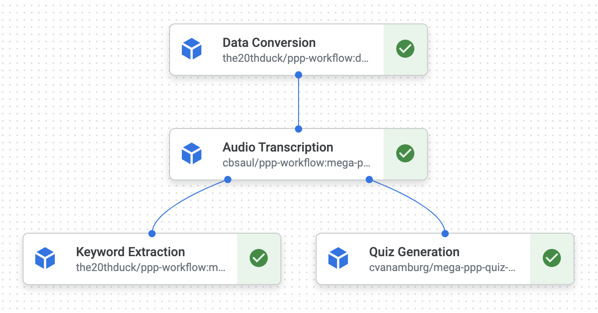

AC215 - Milestone4

Project Organization
------------
    .
    ├── LICENSE
    ├── .dvc 
    ├── notebooks            <- Jupyter notebooks for EDA and model testing
    │   ├── intial_model_construction.ipynb
    │   └── tf_intial_model_construction_with_multigpu.ipynb
    ├── README.md
    ├── reports              <- Folder containing past milestone markdown submissions
    │   └── milestone2.md
    │   └── milestone3.md
    ├── images               <- Folder containing wandb image
    │   └── wandb.png
    ├── cli.py               <- Files in the root of repo for data versioning
    ├── docker-shell.sh
    ├── Dockerfile
    ├── Pipfile
    ├── Pipfile.lock
    ├── requirements.txt
    ├── keyword_dataset.dvc
    └── src                  <- Source code and Dockerfiles for data processing and modeling
        ├── individual-containers <- initial iteration of containers to be run independently of the pipeline, from earlier milestones.
        └── pipeline-workflow
            ├── model-deployment <- Script to deploy and get predictions from the keyword extraction model
            │   ├── Dockerfile
            │   ├── Pipfile
            │   ├── Pipfile.lock
            │   ├── docker-shell.sh
            │   ├── docker-entrypoint.sh
            │   └── cli.py
            ├── audio-transcription <- Use Whisper JAX for transcription
            │   ├── Dockerfile
            │   ├── Pipfile
            │   ├── Pipfile.lock
            │   ├── docker-shell.sh
            │   ├── docker-entrypoint.sh
            │   └── cli.py
            ├── quiz-generation  <- generate quizzes from transcribed text
            │   ├── Dockerfile
            │   ├── Pipfile
            │   ├── Pipfile.lock
            │   ├── docker-shell.sh
            │   ├── docker-entrypoint.sh
            │   └── cli.py
            ├── data-conversion <- Convert video to audio file
            │   ├── Dockerfile
            │   ├── Pipfile
            │   ├── Pipfile.lock
            │   ├── docker-shell.sh
            │   ├── docker-entrypoint.sh
            │   └── cli.py
            └── model_training    <- Scripts for training keyword extraction model
                └── package
                └── Dockerfile
                ├── Pipfile
                ├── Pipfile.lock
                ├── docker-shell.sh
                ├── docker-entrypoint.sh
                ├── package-trainer.sh
                ├── cli.sh
                ├── cli.py
                └── package
                    ├── PKG-INFO
                    ├── setup.cfg
                    ├── setup.py
                    └── trainer
                        ├── task.py
                        └── __init__.py

            
                

--------
# AC215 - Milestone4 - Learning Tools for Transcribed Lecture Audio

**Team Members**
Cyrus Asgari, Ben Ray, Caleb Saul, Warren Sunada Wong, Chase Van Amburg

**Group Name**
Pavlos' Perceptron Pals

**Project**
In this project we aim to develop an application that can process lecture videos to generate transcripts with key-word highlighting and offer auto-generated quizzes with both questions and answers.

**Recap of work to date (see `reports/milestone2.md` and `reports/milestone3.md` for more details)**
We built the four main containers - video to audio preprocessing, audio transcription, keyword highlighting, quiz generation - that we will use in our pipeline for deployment, in addition to a container that takes care of data versioning and a container that runs training for our keyword extraction model. We have utilized several advanced tools to optimize our preprocessing and training workflows, including usage of TensorFlow Data, Dask for efficient transformations of lecture videos, support for serverless training with Vertex AI on multiple GPUs, and performance tracking with Weights & Biases.

### Milestone 4 ###

Aside from a presentation (see `reports/milestone4_presentation.pdf`), our efforts in this milestone focused on:
1. Optimizing training of a keyword extraction model, so that it was ready for deployment.
2. Using Vertex AI (Kubeflow) pipelines for the deployment of our four main containers.

In training, we have experimented with different versions and derivations of the BERT model (accessed via `TFAutoModelForTokenClassification`) to improve our performance on keyword extraction. All experiments were run on a single A100 GPU on Vertex AI, although we have also fully implemented and tested support for training on multiple GPUs, using TensorFlow's support for distributed training (i.e. `tf.distribute.MirroredStrategy()`). We have tracked our performance of our many training runs using Weights & Biases and stored our model artifacts on the platform. We have chosen to deploy the `distilbert-base-uncased` model, which performed well in terms of inference time and achieved 99% of the performance of the undistilled `bert-base-uncased` model.

Aside from serverless training with Vertex AI, our four main containers have all been formulated into a Vertex AI (Kubeflow) pipeline, allowing for effective orchestration of our app's components and usage of cloud functions. These containers preprocess inputted videos, transcribe them, extract key words with the deployed model, and generate quiz questions from the transcribed text.

In the remainder of this update, we will explain the code structure of the [deliverables](https://harvard-iacs.github.io/2023-AC215/milestone4/) for Milestone 4. Given the size of the codebase, please note that we reserve this space for describing the deliverables for Milestone 4 only, and usage of other parts of the codebase is desribed in earlier reports (see `reports/milestone2.md` and `reports/milestone3.md`).

#### Code Structure

**Machine Learning Workflow Implementation**

Having completed preprocessing, we train our model using the `src/model_training` container with usage as follows:

(1) `src/model_training/docker-shell.sh` - this script creates a container (defined in `src/model_training/Dockerfile`) for running training in a standardized environment. Run with `sh docker-shell.sh`.

(2) `src/model_training/package` - this package contains all the necessary scripts for running training, tracking performance via Weights & Biases, and saving the trained model artifact. Before running serverless training, this package is compiled by running `sh package-trainer.sh` inside the Docker container.

(3) `src/model_training/cli.sh` - we use this script to submit the serverless job to Vertex AI, specifying parameters for training and the `ACCELERATOR_COUNT` for running training with multiple GPUs. Run with `sh cli.sh`.

Below you can see the results of our serverless training experiments on an A100 chip. We experimented with small models (e.g. `roberta-tiny-cased-trained`) which has only 28M parameters, and large models (e.g. the original BERT and RoBERTa models) which have over 100M parameters. Naturally, the smaller models performed inference faster but with a lower accuracy. We were able to find a useful compromise using model distillation. The distilled BERT and RoBERTa models achieved 99% of the accuracy achieved by the full-sized models with an acceptable inference time for deployment. Finally, we chose to deploy the `distilbert-base-uncased` model because of its very slight performance advantage over `distilroberta-base`.

**Vertex AI (Kubeflow) Pipeline Implementation**

Below you can see two images related to our work with Vertex AI Pipelines. The first showcases our models which we've saved within the Vertex AI Model Registry, and the second is our Endpoints, which are our models that are available for model prediction requests.

We designed our Kubeflow Pipeline for handling what will be user inputted videos, and generating corresponding key-word highlighted texts along with generated quizzes. The pipeline consists of four main components; the structure can be visualized below: 

(1) Data Conversion: This component and subdirectory found in 'src/pipeline-workflow/data-conversion' simply converts user video files (mp4) to audio files (mp3). Note that this container makes use of Dask to parallelize the process of video conversion with the moviepy library.

(2) Audio Transcription: This component and subdirectory found in 'src/pipeline-workflow/audio-transcription' transcribes the audio files to text files using the Whisper Jax model.

(3a) Keyword Extraction: This component and subdirectory found in 'src/pipeline-workflow/model-deployment' deploys our trained key-word highlighting Distilbert model and conducts inference on the transcribed text. The model is downloaded from Weights & Biases with its trained parameter set.

(3b) Quiz Generation: This componet and subdirectory found in 'src/pipeline-workflow/quiz-generation' utilizes the transcribed text and forms an prompt to be inputted into the OpenAI GPT API.

**Addenda to Presentation (10/24)**
We have included an updated set of slides (see `reports/milestone4_presentation.pdf`) with two slight adjustments:
1. The diagram on slide 3 now shows that our Quiz Generation container for now only generates quizzes based on the lecture transcript and does not yet use the keywords. A next step is to improve the keyword extraction container using prompt engineering that makes use of the keywords from the Keyword Extraction container.
2. The diagram on slide 8 now shows the Model Training container as separate from the deployed pipeline, for the sake of clarity.
