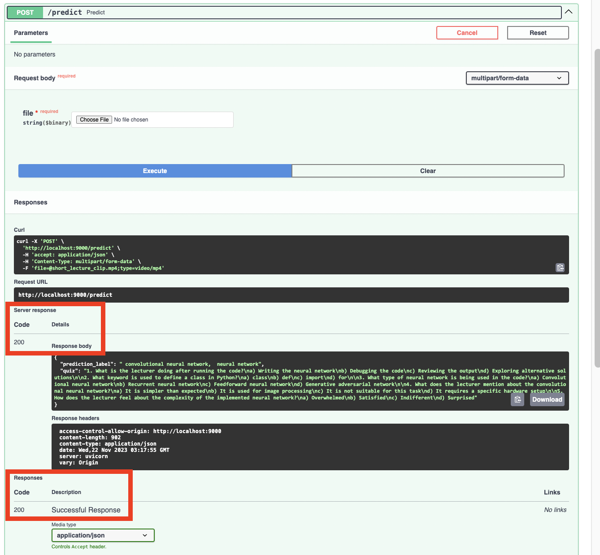
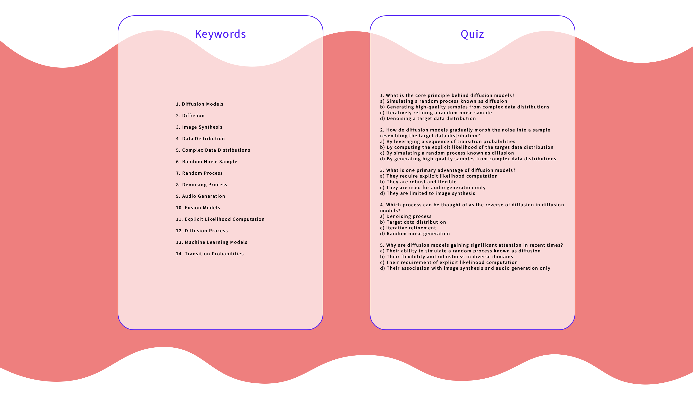

# PAVVY: Learning Tools for Lecture Content

*Pavlos' Perceptron Pals (Cyrus Asgari, Ben Ray, Caleb Saul, Warren Sunada Wong, Chase Van Amburg)*

This repository was produced as part of the final project for Harvard’s AC215 Fall 2023 course. The purpose of this `README` is to explain to a developer how to utilize this repository, including usage of the individual containers that comprise the PAVVY app, the model training workflow, and deployment to a Kubernetes Cluster using Ansible. For a more accessible overview of the project, please see our Medium post [here](TODO) and a video (including a live demo of PAVVY) [here](TODO).

## Introduction

PAVVY is an application that can process lecture videos or transcripts to produce keyphrases and generate quizzes, which allow learners to better review and engage with lecture content.

The deployed PAVVY application comprises of four main containers - video to audio preprocessing, audio transcription, keyword highlighting, quiz generation. These four containers can be run atomically from the `src/pipeline-workflow/` directory. In addition, we have a container that takes care of data versioning (found in the root of the repository) and a container that runs training for our keyword extraction model (found in `src/pipeline-workflow/model-training`).

We utilized several MLOps tools to optimize our data preprocessing and training workflows, including usage of TensorFlow Data, Dask for efficient transformations of lecture videos, support for serverless training with Vertex AI on multiple GPUs, and performance tracking with Weights & Biases. Upon completing training, our four main containers were formulated into a Vertex AI (Kubeflow) pipeline, allowing for effective orchestration of our app's components.

The trained model was deployed to an endpoint in Vertex AI, while the other containers were deployed to cloud functions and Cloud Run, accessible via an API. The final application comprises of a frontend built using React (found in `src/frontend-react`) and a backend API service using FastAPI to expose the models' functionality to the frontend (found in `src/api-service`). The entire application is then deployed to a Kubernetes Cluster using Ansible (using the files found in `src/deployment`).

The usage of these directories is explained in this `README` to allow a developer to replicate our steps. Despite the process being simple to follow, a developer is expected to have robust coding experience and some experience with MLOps to be able to fully interact with the external services (such as Google Cloud Platform) that are necessary for this project.

## Project Organization
------------
    .
    ├── LICENSE
    ├── .dvc 
    ├── notebooks            <- Jupyter notebooks for EDA and model testing
    │   ├── intial_model_construction.ipynb
    │   └── tf_intial_model_construction_with_multigpu.ipynb
    ├── README.md
    ├── reports              <- Reports, midterm presentation, application design document
    │   ├── application_design.pdf
    │   ├── milestone2.pdf
    │   ├── milestone3.pdf
    │   ├── milestone4.md
    │   └── milestone4_presentation.pdf
    ├── images               <- Folder containing images used in reports
    ├── cli.py               <- Files in the root of repo for data versioning
    ├── docker-shell.sh
    ├── Dockerfile
    ├── Pipfile
    ├── Pipfile.lock
    ├── requirements.txt
    ├── keyword_dataset.dvc
    └── src                  <- Source code and Dockerfiles for training and deployment
        ├── pipeline-workflow
        │   ├── model-deployment    <- Script to deploy and get predictions from the keyword extraction model
        │   │   └── ...
        │   ├── audio-transcription <- Use Whisper JAX for transcription
        │   │   └── ...
        │   ├── quiz-generation     <- Generate quizzes from transcribed text
        │   │   └── ...
        │   ├── data-conversion     <- Convert video to audio file
        │   │   └── ...
        │   └── model_training      <- Scripts for training keyword extraction model
        │       └── ...  
        ├── api-service     <- Code for backend
        │   ├── api                 <- Scripts that call cloud functions, cloud run, and Distilbert endpoint
        │   │   ├── model.py
        │   │   ├── service.py
        │   │   └── tracker.py
        │   ├── docker-shell.sh
        │   ├── docker-entrypoint.sh
        │   ├── Dockerfile
        │   ├── Pipfile
        │   └── Pipfile.lock
        ├── frontend-react <- Code for frontend
        │   └── src
        │   │   └── ...
        │   ├── docker-shell.sh
        │   ├── Dockerfile
        │   ├── Dockerfile.dev
        │   ├── package-lock.json
        │   ├── package.json
        │   └── yarn.lock
        └── deployment     <- Code for deployment to GCP with Ansible
            ├── cli.py
            ├── deploy-app.sh
            ├── deploy-create-instance.yml     <- Creates App Application Machine on GCP
            ├── deploy-docker-images.yml       <- Builds Docker images and pushes them to GCR
            ├── deploy-k8s-cluster.yml         <- Creates Kubernetes Cluster and deploys containers
            ├── deploy-provision-instance.yml  <- Configures app server instance
            ├── deploy-setup-containers.yml    <- Configures containers on app server
            ├── deploy-setup-webserver.yml     <- Configures webserver on the server instance
            ├── docker-entrypoint.sh
            ├── docker-shell.sh
            ├── Dockerfile
            ├── inventory.yml                  <- Defines global variables for Ansible
            └── run-ml-pipeline.sh

--------

## Individual Containers 
### Video to Audio Preprocessing
TODO: M2

### Audio Transcription
TODO: M2

### Keyword Highlighting
TODO: M2

### Quiz Generation
TODO: M2


## Model Training Workflow
TODO: M3 + M4

## Application Design
### Backend API Service

We built a backend api service using fast API to expose model functionality to the frontend. Fast API gives us an interactive API documentation and exploration tool for free. An image of the documation tool is included below:


`/predict` is called when users upload a lecture video to the frontend and wish to extract keywords and generate a quiz from it. `/predicttext` is used when users upload a lecture transcript to the frontend and wish to extract keywords and generate a quiz from it. These options are clear to see in the frontend below.

We can also easily test our APIs using this tool. Screenshots from successful tests of both `/predict` and `/predicttext` are included below:



It is clear to see from this `/predict` testing that the server response is successful, with the response body returning keywords and a generated quiz as expected.


A sucessful sever response is also observed from `/predicttext`.

The `api-service` container has all the files to run and expose the backend APIs.

To run the container locally:
- Open a terminal and navigate to `/src/api-service`
- Run `sh docker-shell.sh`
- Once inside the docker container run `uvicorn_server`
- To view and test APIs go to `http://localhost:9000/docs`

### Frontend Implementation

We have built a React app with Material UI framework to extract keywords and generate quizzes from lecture videos or lecture transcripts. Using the app, a user easily uploads their lecture video or text file. The app will send the video or text file through to the backend API to get the outputs. 

Here is a screenshot of our original version of the frontend:


And here are a set of screenshots of the final frontend:



The structure of the frontend is described by Material UI `<Container>` components, along with `<Typography>` and `<Button>` elements. Background images are custom .svg elements. File upload is the input that gets sent through the backend, and the Keyword and Quiz boxes are the output from the backend to the frontend. The `frontend-react` container contains all the files to develop and build our React app. 

Based on the Material UI framework, the `/app` folder contains specifications for high-level styling, such as for general `<Typography>` elements,  and overall structure of the application. The `index.js` file of the homepage holds the bulk of Pavvy's frontend code, under `/components/home`. Here, we connect with `api-service/service.py` to communicate with the backend.

To run the container locally:
- Open a terminal and navigate to `/src/frontend-react`
- Run `sh docker-shell.sh`
- If running the container for the first time, run `npm install`
- To include additional dependencies, run `npm install @emotion/react react-spinners`
- Once inside the docker container run `yarn start`
- Go to `http://localhost:3000` to access the app locally

Note that the above will only be hosted is the `api-service` container is running as well.

## Deployment to Kubernetes Cluster using Ansible.

**Ansible Usage For Automated Deployment**

We use Ansible to create, provision, and deploy our frontend and backend to GCP in an automated fashion. Ansible allows us to manage infrastructure as code, helping us keep track of our app infrastructure as code in GitHub. It helps use setup deployments in an automated way.

Here is our deployed app on a single VM in GCP:


The deployment container helps manage building and deploying all our app containers through Ansible, with all Docker images going to the Google Container Registry (GCR). 

To run the container locally:
- Open a terminal and navigate to `/src/deployment`
- Run `sh docker-shell.sh`
- Build and push Docker Containers to GCR
```
ansible-playbook deploy-docker-images.yml -i inventory.yml
```

- Create Compute Instance (VM) Server in GCP
```
ansible-playbook deploy-create-instance.yml -i inventory.yml --extra-vars cluster_state=present
```

- Provision Compute Instance in GCP, install and setup all the required things for deployment.
```
ansible-playbook deploy-provision-instance.yml -i inventory.yml
```

- Setup Docker Containers in the  Compute Instance
```
ansible-playbook deploy-setup-containers.yml -i inventory.yml
```

- Setup Webserver on the Compute Instance
```
ansible-playbook deploy-setup-webserver.yml -i inventory.yml
```
Once the command runs go to `http://<External IP>/` to interact with the website.

**Deployment to Kubernetes**

Kubernetes (K8s) is an open-source container orchestration system for automated scaling and management. We use Kubernetes to deploy our app on multiple servers with automatic load balancing and failovers.

Here is our deployed app on the GCP Kubernetes Engine:


To create the Kubernetes Cluster, enable the relevant APIs and run the following code to start the container:
```
cd deployment
sh docker-shell.sh
```
From inside the container, initialize the cluster on Google Cloud:
```
gcloud container clusters create test-cluster --num-nodes 2 --zone us-east1-c
```
And finally deploy the app:
```
kubectl apply -f deploy-k8s-tic-tac-toe.yml
```
Copy the External IP from the kubectl get services, then go to `http://<YOUR EXTERNAL IP>` to use Pavvy.

